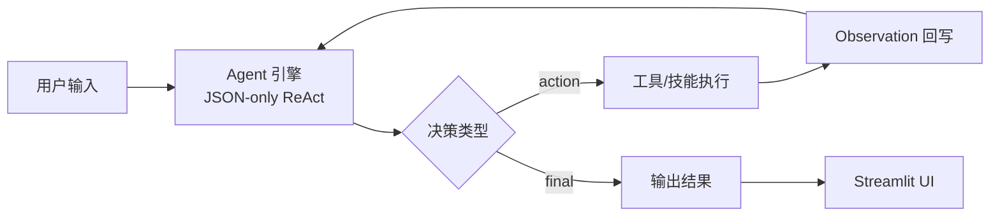

# Game-writer：游戏编剧工作台（Streamlit + Tool/Skill Agent）

面向“游戏编剧/世界观设定”场景的个人工作台：用 **对话式 Agent** 串联 **设定库检索** 与 **技能插件**，把“写作、校对、导出、版本管理”等动作做成可重复的工作流。

- **我做了什么**
  - 约 **一周**内完成从 0→1：**技术选型、整体方案、主导落地**（AI 辅助开发：Cursor）。
  - **需求拆解、架构分层**；敲定 **JSON-only 协议**、工具/技能边界、**RAG 可选与降级**、skills 迭代等关键约束。
  - 对生成代码持续 **审阅、集成与回归**，保证功能可用、行为可控、结构可扩展。

- **交付物**
  - 可下载 **zip**：解压后按 README 配置 **`.env`**，**`run.bat` 一键启动**。
  - 使用者自备：**LLM API**；若需访问外网则自行配置 **代理**。

- **验收标准**
  - **`run.bat`** 可启动并正常打开网页端。
  - **`pytest` 全绿**。
  - **RAG 关闭**时核心能力仍可用（不依赖向量链路）。
  - **技能诊断**通过：Runner 可加载、**`run()`** 可调用。
  - 网页端实操：能生成指定内容并 **保存为 Markdown**。

## 核心亮点

- **JSON-only ReAct**
  - 每步仅一个 JSON：`action`（调工具）或 `final`（收束输出）。
  - 读写/检索等真实动作须先 `action`，经 **Observation** 回写后再 `final`（避免未调用工具却声称已写入）。
  - 最大步数、历史截断与日志 → **可复现、可调试、可追踪**。
- **设定库证据检索**
  - `data/**/*.md` **分块 + 元数据**；关键词检索 + **SettingsRoute**（`list` / `files` / `chunks` / `search`）。
  - 结果带稳定 **`chunk_ref`**，便于证据驱动写作与改设定。
- **RAG 可选 + 降级**
  - 默认：**分块 + 关键词**；按需开 **Chroma + 本地 embedding**。
  - 依赖缺失、加载失败、证书等问题时 **自动退回关键词检索**，主流程不绑死向量能力。
- **工具注册**
  - 读/写/检索/技能/偏好等集中在统一 **registry**，入参协议一致（例：`WriteFile=相对路径|正文`）。
- **技能插件与 UI 闭环**
  - 约定 **`skills/*/SKILL.md` + `scripts/run.py`**（`run(input_text) -> str`），**增技能不改引擎**。
  - UI 自动扫描；中文别名、Runner 诊断；多方案结果可用按钮继续细化。

## Demo

- bilibili：[【AI Agent 实战】游戏编剧工作台功能演示（开源）](https://www.bilibili.com/video/BV168DaBSEou/?share_source=copy_web&vd_source=603cd91969c3f5e2d672d7eca8520091) 

## 功能概览

- **对话式 Agent**：根据你的需求选择工具/技能，必要时写入文件
- **资料库**：只读预览 `data/**/*.md`
- **技能目录**：扫描 `skills/*/SKILL.md` 并展示调用方式（含中文别名）
- **开发工具（可选）**：健康检查、API 最小请求测试、技能 Runner 诊断、RAG 开关等

## 内置技能一览

> 技能由 `skills/*/SKILL.md` 定义，运行入口由 `skills/*/scripts/run.py` 实现（约定 `run(input_text: str) -> str`）。

- `outline-writer`：生成剧情大纲（多方案）
- `dialogue-voice`：对白风格/口吻方案（多方案）
- `consistency-checker`：一致性检查（设定/角色/时间线等）
- `version-control`：版本/变更管理相关动作
- `setting-splitter`：将设定拆分成更可检索/可复用的结构

## 架构速览

```text
Streamlit UI (src/ui/streamlit_app.py)
  └─ run_agent(...)
      └─ Agent Engine (src/core/engine.py)  # JSON-only ReAct 循环
          ├─ Tool Registry (src/core/tool_registry.py)
          ├─ Skills Catalog / Runner (skills/*)
          └─ Data & Preferences
              ├─ data/**/*.md               # 设定库（只读预览 + 检索）
              └─ config/preferences.md      # 偏好（可选写入，受开关控制）
```

**Agent 对话主循环（示意）**：



## 配置环境变量（.env）

项目使用 `.env`（由 `python-dotenv` 自动读取）来配置 LLM 访问。

也可以先复制模板：`.env.example -> .env`，再编辑成你的实际值。

至少包含：

```env
DEEPSEEK_API_KEY=你的_api_key
DEEPSEEK_BASE_URL=https://api.deepseek.com/v1
```

如你需要代理（例如访问外网需走本地代理），可以额外设置：

```env
HTTP_PROXY=http://127.0.0.1:26561
HTTPS_PROXY=http://127.0.0.1:26561
```

注意：请不要把真实 `.env` 配到公共仓库/聊天记录里。

可选：当对话里曾出现大段设定原文、且已拆分进 `data/` 后，Agent 引擎会**自动缩短**历史消息与多步回溯里的超长 JSON/Observation，减少重复计费。默认值一般够用；若要调整（字符数，`0` 表示不限制该项）：

```env
AGENT_HISTORY_MESSAGE_MAX_CHARS=4000
AGENT_SCRATCHPAD_ACTION_INPUT_MAX_CHARS=2500
AGENT_OBSERVATION_MAX_CHARS=16000
```

## 快速开始

适合面试官/快速体验：无需本地装 Python，只需要 Docker。

### 方式 A：拉取预构建镜像（最快）

先准备一个 `.env`（不要提交到仓库），并在当前目录准备一个 `data/` 文件夹（可为空）。

```bat
docker run --rm -p 8501:8501 ^
  -v "%CD%\data:/app/data" ^
  --env-file .env ^
  ghcr.io/athas-ed/game-writer:latest
```

浏览器打开：`http://localhost:8501`

### 方式 B：从源码构建镜像

```bat
docker build -t game-writer .
docker run --rm -p 8501:8501 ^
  -v "%CD%\data:/app/data" ^
  --env-file .env ^
  game-writer
```

### 方式 C：Docker Compose（更稳：只挂载 data）

```bat
docker compose up --build
```

停止并清理容器：

```bat
docker compose down
```

## 快速体验

以下两个核心操作无需任何准备，复制指令发送即可看到效果。

### 1. 拆分长文本设定

复制下方命令并发送：

```text
帮我拆分以下长文本设定集并保存到合适的位置：

### 势力：星环联盟
一个致力于太空探索的组织，总部位于火星前哨站。

### 地点：火星前哨站
位于火星乌托邦平原，设有科研区、居住区和能源中心。

### 人物：艾琳娜
星环联盟首席工程师，擅长能源系统修复，性格冷静果断。
```

Agent 会自动拆分成多个 Markdown 文件，保存到 `data/` 对应目录。你可以在上方“资料库”中浏览生成的文件。

### 2. 构思角色

复制下方命令并发送：

```text
帮我构思一个隶属于该势力的特工，擅长格斗、喜欢养花，与现有的角色建立联系，其余设定合理扩充
```

Agent 会自动生成角色设定的 Markdown 文件，保存到 `data/角色设定/`目录。你可以在上方“资料库”中浏览生成的文件。

### 3. 生成对白（含方案选择）

复制下方命令并发送：

```text
生成新角色与艾琳娜的对白方案，保存到关键对话下。
```

Agent 会返回两种语气风格的对白，并提供按钮供你选择。选中的方案将保存到 `data/关键对话/` 目录。

> 更多功能（剧情大纲、版本管理、地点补充）请观看 [完整演示视频](https://www.bilibili.com/video/BV168DaBSEou/?share_source=copy_web&vd_source=603cd91969c3f5e2d672d7eca8520091)。


## 本地运行（Windows / Python）

**版本锁定以 `pyproject.toml` 为准**（`requirements.txt` / `requirements-dev.txt` 仅作为可编辑安装入口，避免重复维护）。

### 依赖安装

1. 准备 Python（推荐 3.10+）
2. 创建虚拟环境：

   ```bat
   python -m venv venv
   ```

3. 安装项目与运行时依赖（二选一，等价）：

   ```bat
   venv\Scripts\python -m pip install -e .
   ```

   或：

   ```bat
   venv\Scripts\python -m pip install -r requirements.txt
   ```

4. 开发/测试依赖（可选）：

   ```bat
   venv\Scripts\python -m pip install -r requirements-dev.txt
   ```

   等价于：

   ```bat
   venv\Scripts\python -m pip install -e ".[dev]"
   ```

### Windows 一键启动（已安装环境下）

> 前置条件：已创建 `venv/`，并在其中安装了至少 `python-dotenv` 与 `streamlit`（见上方“依赖安装”）。

直接运行：

```bat
run.bat
```

启动后浏览器打开：`http://localhost:8501`

### 手动启动（等价，适合排障）

```bat
venv\Scripts\python -m streamlit run src\ui\streamlit_app.py ^
  --server.address=localhost --browser.gatherUsageStats=false
```

## 使用方法

1. 在网页左侧选择模式：
   - 工作模式：聚焦聊天、资料库和技能
   - 开发模式：额外显示 API 测试与技能 Runner 检查
2. 在“对话”输入你的需求，例如：
   - “帮我写一个剧情大纲：主角在废弃车站发现一封旧信。”
3. Agent 会优先选择合适技能（见「内置技能一览」）。
4. 若技能需要读取本地设定，会从 `data/` 汇总读取相关 Markdown。

## 技能扩展说明

技能由 `skills/*/SKILL.md` 定义，运行入口由技能目录中的 `scripts/run.py` 实现：

- `skills/outline_writer/SKILL.md`：技能描述与使用示例
- `skills/outline_writer/scripts/run.py`：实现 `run(input_text: str) -> str`

Agent 通过 `RunSkill` 工具调用技能，并将返回内容展示到聊天里。

## 发布镜像（GHCR / GitHub Actions）

本仓库已提供工作流：`.github/workflows/docker-ghcr.yml`。

- 推送到 `master`：自动发布 `ghcr.io/athas-ed/game-writer:latest`
- 打 tag（例如 `v0.1.0`）并 push：自动发布 `ghcr.io/athas-ed/game-writer:v0.1.0`

```bat
git tag v0.1.0
git push origin v0.1.0
```

## Roadmap / Limitations（可选，待你决定是否保留）

> **Roadmap**：后续计划做什么（1–5 条即可，偏“用户价值/工程能力”）。  
> **Limitations**：当前版本的边界与已知限制（让评审更信任你“知道自己没做什么”，也便于面试时展开）。

### Roadmap

1. 在实际使用中继续完善现有功能  
   - 优化主流程的稳定性与可控性（日志、错误提示、降级策略等）
   - 打磨 UI 交互与写作体验（多方案选择、继续追问、保存/导出等）
2. 根据实际需求开发新技能  
   - 将高频写作动作沉淀为“可复用技能”（示例：人物/地点扩写、冲突设计、对白润色、设定一致性修复）
   - 完善技能工程化（规范模板、Runner/诊断、回归用例），让新增技能尽量“开箱即用”
3. 尝试探索企业级的架构设计  
   - 引入更清晰的模块边界与可观测性（配置、权限、审计、成本统计等）
   - 为团队协作预留形态（多项目/多知识库、环境隔离、发布与回滚策略等）

### Limitations

1. 时间与 tokens 开销待优化  
   - 多轮对话与多步工具链会带来额外调用成本；复杂任务下响应时间仍可能偏长
2. 只适合个人自用，难以汇入企业级工作流  
   - 目前偏“单机 + 个人知识库 + 手动流程”，缺少企业常见的鉴权、权限分级、审计/合规与团队协作能力

## 联系方式
- **Email**：`zhoumi383@foxmail.com`
- **GitHub**：`https://github.com/Athas-Ed/`
- **QQ**：`1392830348`
